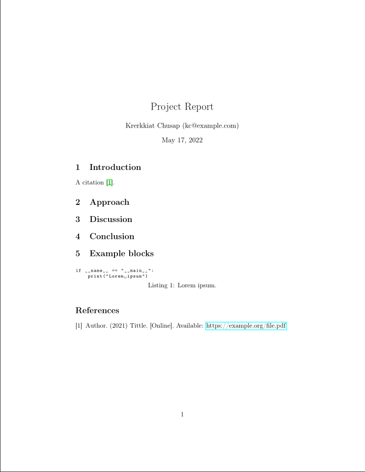

# cookiecutter-org-report

Generate an org-mode-base report document with IEEE citation style.



## Requirements

- Emacs' org-mode
- `org-ref` package
- LaTeX

## Use this template

```console
cookiecutter gh:krerkkiat/cookiecutter-org-report
```

